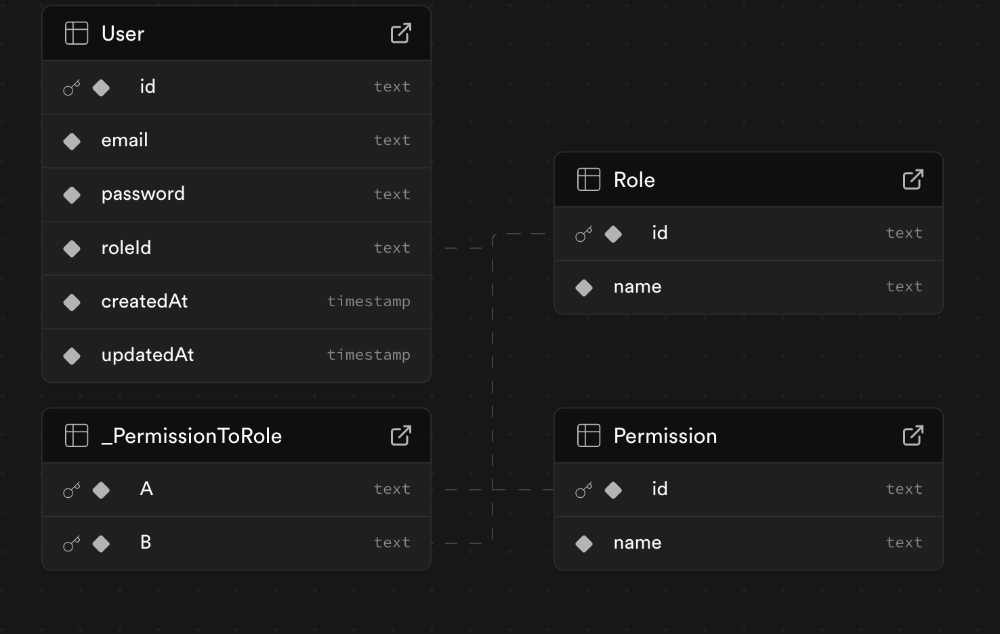

# Authentication, Authorization, and RBAC System

This project demonstrates a robust implementation of Authentication, Authorization, and Role-Based Access Control (RBAC) using modern web technologies. It allows users to sign up, log in, and access different routes based on their roles, ensuring secure handling of user data and proper permissions enforcement.

---

## Tech Stack

- **Frontend:** Next.js (App Router), ShadCN UI for styled components
- **Backend:** Next.js API Routes
- **Database:** PostgreSQL with Prisma ORM
- **Authentication:** JWT-based authentication
- **RBAC:** Managed using user roles and permissions
- **UI Notifications:** ShadCN UI Toasts

---

## Features

1. **User Authentication:**
   - Users can sign up with their email, password, and role.
   - Users log in to receive a JWT token stored as an HTTP-only cookie.

2. **Authorization:**
   - Middleware protects routes by checking user roles and permissions.
   - Admin-only routes are restricted to users with the Admin role.

3. **Role-Based Access Control (RBAC):**
   - Roles are stored in the database and assigned to users.
   - Permissions are linked to roles to control access to resources.
   - Admins can update roles for other users.

4. **Frontend Notifications:**
   - Toast notifications for success and error messages.

5. **Protected Routes:**
   - **Admin Dashboard:** Accessible only by Admins.
   - **User Dashboard:** Accessible by all logged-in users.

---

## Setup and Installation

### Prerequisites

1. Node.js (v16+)
2. PostgreSQL installed and running

### Installation

1. **Clone the repository:**

```bash
git clone <repository-url>
cd <project-directory>
```
2.	Install dependencies:

```bash
npm install
```

3.Configure environment variables:
Create a .env file with the following:
```bash
DATABASE_URL=postgresql://<user>:<password>@localhost:5432/<database>
JWT_SECRET=your_secret_key
```

4.	Run Prisma migrations:
```bash
npx prisma migrate dev
```

5.	Seed the database (optional):
```bash
node prisma/seed.js
```

6.	Start the development server:
```bash
npm run dev
```
Workflow

Authentication

	1.	Signup:
	•	Endpoint: /api/auth/register
	•	User details are validated and stored securely with a hashed password.
	2.	Login:
	•	Endpoint: /api/auth/login
	•	Credentials are validated, and a JWT token is generated with user details and role.
	•	The token is stored as an HTTP-only cookie.
	3.	Logout:
	•	Endpoint: /api/auth/logout
	•	Clears the auth_token cookie.

Authorization

	1.	Middleware:
	•	Verifies the presence of a valid JWT token.
	•	Decodes the token to determine the user’s role and permissions.
	•	Redirects unauthorized users to /unauthorized or /login.
	2.	RBAC Logic:
	•	Permissions are tied to roles in the database.
	•	Admin-only routes require Admin role verification.

Frontend

	1.	Sign Up and Login Pages:
	•	Built using ShadCN UI components (Button, Input, Select).
	•	Toast notifications for success and error messages.
	2.	Dashboards:
	•	Admin Dashboard:
	•	Allows role management for users.
	•	Protected by middleware and role validation.
	•	User Dashboard:
	•	Displays user-specific content.
	3.	Logout:
	•	Clears the session and redirects to the login page.
# Database Schema and Seed Data

## User and Role Schema



## Permissions Table


## Roles Table


## Seeded Users


## Permissions to Role Mapping


Future Improvements

	1.	Add support for OAuth-based authentication.
	2.	Implement email verification for signup.
	3.	Introduce paginated user management for admins.
	4.	Enhance role/permission management with a UI.

Conclusion

This project provides a secure and scalable foundation for managing authentication, authorization, and RBAC in web applications using modern frameworks and best practices. It is easy to extend with additional features like OAuth, email verification, or multi-factor authentication.

Feel free to contribute or raise issues for improvements!

